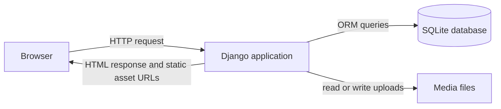

# Fan Hub Plus — Fandom Universe Portal

## 1. Project Overview

Fan Hub Plus is a Django web application for browsing and engaging with entertainment fandoms in one place. It brings together a categorized content catalog, character profiles, articles and community submissions, media listings, merchandise showcases, events, user bookmarks, feedback, and staff tools. The application uses server-rendered Django templates with HTML, CSS, and JavaScript, and stores application data in SQLite by default.

**Theme:** Fandom Universe

**Course category:** End-to-End Web Solutions

**Author:** Student submission for End-to-End Web Solutions

**Demo:** local demo only; no deployed demo URL is configured in this repository.

**Repository:** [GitHub source](https://github.com/Ikedi-21/FandomUniverse)

| Area           | Technology                                        |
| -------------- | ------------------------------------------------- |
| Language       | Python 3.13                                       |
| Web framework  | Django 6.1.1                                      |
| Frontend       | Django templates, HTML5, CSS3, vanilla JavaScript |
| Database       | SQLite by default; optional MySQL configuration   |
| Authentication | Django authentication with custom `accounts.User` |
| Uploaded media | Django media files under `media/`                 |
| Dependencies   | Listed in `requirements.txt`                      |

The repository is organized as a Django project package (`FandomUniverse/`), a `manage.py` entry point, and separate apps for accounts, catalog content, articles, chatbot FAQs, characters, dashboards, engagements, media ratings, events, and merchandise. Shared templates and static assets are at the root; uploads are stored in `media/` during local development.

## 2. Problem Definition

A fandom is a community of people who share an interest in a work, genre, creator, or entertainment franchise. Fans may want to discover stories, videos, characters, events, and other community-created material related to that interest, as well as keep track of items they want to revisit.

Many online spaces focus on one fandom or one type of activity. A fan who follows anime, games, films, or K-pop may need to search several sites, each with different ways to browse and save material. This scatters discovery and makes it harder to move between fandoms or find related content in one consistent place.

Fan Hub Plus addresses that problem with a single portal organized around multiple fandom categories and content types. Existing single-fandom platforms can serve their own communities well, but they do not necessarily provide a shared catalog, common account preferences, bookmarks, event listings, and moderation across different entertainment interests. This project explores that unified approach as a student web application; it does not claim to replace existing fan communities.

## 3. Proposed Solution

Fan Hub Plus provides visitors with public browsing and registered users with additional account-based features. Its catalog and related sections organize content and community features under eight categories: **Anime, Gaming, Movies, TV Shows, K-Pop, Comics, Manga, and Cosplay**. The database command seeds those categories for a fresh demo database.

The application supports three practical access roles:

| Role            | Capabilities represented in the application                                                                                                                                                                  |
| --------------- | ------------------------------------------------------------------------------------------------------------------------------------------------------------------------------------------------------------ |
| Visitor         | Browse public content, characters, articles, merchandise, and published events. Some advanced catalog filters and interactive actions require sign-in.                                                       |
| Registered User | Use a dashboard, save bookmarks and notes, rate catalog content, submit content for review, send feedback, and set profile display preferences. Email verification is required by the `accounts` login flow. |
| Admin / Staff   | Use staff-protected dashboard pages to review submissions, manage catalog content and chatbot FAQs, and manage article highlights. Django's built-in admin is available at `/admin/`.                        |

## 4. Scope of Project

**In scope**, based on the requested SRS functional requirements, are:

- Account registration, sign-in, sign-out, email verification, password reset, and profile preferences.
- A personalized user dashboard and favorite fandom categories.
- A fandom content explorer with categories, genres, search/filter controls, sorting, and pagination.
- An optional FAQ assistant that matches messages against configured keywords.
- A multimedia listing based on video and audio catalog entries, with content ratings.
- Character profiles, article browsing, event highlights, and fan-submitted content awaiting review.
- A merchandise showcase with category, search, sorting, upcoming items, and detail pages.
- User feedback and basic staff dashboard counts.
- Bookmarks and notes for supported object types, plus share/copy-link controls on selected detail pages.
- Published event listings with city/category filtering, text search, venue details, and event dates.
- Staff moderation and content/FAQ/highlight management.
- UI preferences for light/dark themes and font size, alongside responsive page layouts.

**Out of scope:** The merchandise pages are a showcase, not a functioning shop. The project does not process merchandise purchases and has no payment gateway. No hosted production deployment, production email service, full map-based event discovery, or full calendar integration is supplied as part of the local demo.

## 5. Functional Requirements (Implementations)

### FR-1: User Authentication and Management

**SRS requirement:** Allow users to register and sign in, and provide account management for authenticated users and administrators.

**Implemented in:** `accounts/` (`User`, registration/login, verification, password reset, and preferences); `FandomUniverse/settings.py` (`AUTH_USER_MODEL`); `core/` also contains legacy registration/login routes.

**How to test:**

1. Open `/accounts/register/` and register using a new username and email.
2. In the default local setup, find the verification link printed in the server terminal and open it.
3. Sign in at `/accounts/login/`, then sign out using the account control.
4. Try `/accounts/password-reset/`; with the console email backend, inspect the terminal output for the reset message.

**Status:** ⚠️ Partial. The `/accounts/login/` flow requires verified email, but the legacy `/login/` route in `core` does not apply that check; the duplicate authentication paths should be consolidated.

### FR-2: Personalized Dashboard

**SRS requirement:** Give signed-in users a dashboard with profile preferences, favorite fandoms, saved items, and recent activity.

**Implemented in:** `dashboard/views.py`, `dashboard/models.py`, `accounts/models.py`, and `dashboard/templates/dashboard.html`.

**How to test:**

1. Sign in and open `/dashboard/`.
2. Review saved bookmarks, favorite categories, submission count, and recent activity.
3. Change theme/font preferences using the available display controls, then reload a page.

**Status:** ✅ Complete for the dashboard information currently stored by the project.

### FR-3: Fandom Content Explorer

**SRS requirement:** Let visitors discover published content by fandom and let signed-in users use additional search and filter options.

**Implemented in:** `catalog/views.py`, `catalog/models.py`, and `catalog/templates/explore.html`; route `/catalog/explore/`.

**How to test:**

1. Open `/catalog/explore/` while signed out and choose a category.
2. Sign in and try text search, genre, year, content type, and sort filters.
3. Open a result to view its detail page and related catalog items.

**Status:** ✅ Complete for the implemented filters; advanced filters are sign-in gated.

### FR-4: AI-Powered Chatbot Assistant (Optional per SRS)

**SRS requirement:** Provide an optional assistant for common site questions.

**Implemented in:** `chatbot/services.py`, `chatbot/views.py`, `chatbot/models.py`, and the shared chatbot widget; POST endpoint `/chatbot/ask/`.

**How to test:**

1. Open the chatbot widget from a page that displays it.
2. Ask about a configured FAQ keyword such as “bookmark” or mention a seeded category.
3. Submit an unrelated question and observe the fallback response.

**Status:** ⚠️ Partial. The assistant is keyword-matched against FAQ records and is not powered by an LLM; the demo seed creates one FAQ, not a large FAQ corpus.

### FR-5: Interactive Multimedia Center

**SRS requirement:** Provide access to multimedia content and allow users to interact with catalog media.

**Implemented in:** `media_centre/views.py`, `media_centre/models.py`, `catalog/models.py`, and `catalog/templates/media-list.html`; routes `/media_centre/` and `/media_centre/rate/`.

**How to test:**

1. Open `/media_centre/` to view published video and audio catalog entries.
2. Open a published catalog item and, while signed in, submit a rating from 1 to 5.
3. Re-rate the same item and confirm the rating is updated rather than duplicated.

**Status:** ⚠️ Partial. Media entries are catalog `Content` records with video/audio types; the project does not implement the broader standalone media library described by the model prototype.

### FR-6: Character Profiles and Featured Articles Hub

**SRS requirement:** Show character profiles, published articles, and featured community/event highlights.

**Implemented in:** `characters/`, `article/`, `article/models.py`; routes `/characters/`, `/article/articles/`, and `/article/highlights/`.

**How to test:**

1. Open `/characters/`, search by character name, and filter by fandom.
2. Open a character profile and inspect the related-character section.
3. Open `/article/articles/` and `/article/highlights/`, then open an article detail page.

**Status:** ✅ Complete for published character, article, and highlight browsing.

### FR-7: Merchandise Showcase and Resource Library

**SRS requirement:** Display merchandise and related resources for fandom communities.

**Implemented in:** `merch/models.py`, `merch/views.py`, `merch/templates/merch-list.html`, and `merch/templates/merch-detail.html`; routes `/merch/` and `/merch/<id>/`.

**How to test:**

1. Open `/merch/` and filter by figures, apparel, or props.
2. Search or sort the listing, then open a merchandise detail page.
3. Confirm the page displays an item rather than completing a purchase.

**Status:** ⚠️ Partial. The merchandise showcase is implemented, but there is no separate resource-library workflow and no real purchasing or payment capability.

### FR-8: Feedback and Analytics

**SRS requirement:** Let users submit feedback and provide staff with basic usage and content summaries.

**Implemented in:** `engagements/views.py`, `engagements/models.py`, `dashboard/views.py`, and `dashboard/templates/admin-overview.html`; routes `/engagements/` and `/dashboard/admin/overview/`.

**How to test:**

1. Sign in and open `/engagements/` to submit a suggestion or bug report.
2. Sign in as a staff user and open `/dashboard/admin/overview/`.
3. Inspect the displayed user/content/submission/chatbot/feedback counts.

**Status:** ⚠️ Partial. Feedback intake and summary counts exist, but there is no full analytics/reporting suite or dedicated staff feedback-resolution workflow in the routed dashboard.

### FR-9: Bookmarking, Notes, and Sharing

**SRS requirement:** Let signed-in users save supported items, attach notes, and share item links.

**Implemented in:** `engagements/models.py`, `engagements/views.py`, and bookmark/share controls in catalog, character, merchandise, and event detail templates.

**How to test:**

1. Sign in, open a catalog item, character, merchandise item, or event, and save it.
2. Add a note and open `/engagements/bookmarks/` to see the saved item and note.
3. Use a visible Share or copy-link control on a supported detail page.

**Status:** ✅ Complete for implemented bookmarkable item types and the share controls present on selected detail pages.

### FR-10: Location-Aware Event Discovery and Calendar

**SRS requirement:** Help users discover events using location and fandom details and view event dates.

**Implemented in:** `events/models.py`, `events/views.py`, and `events/templates/event-list.html`; routes `/events/` and `/events/<id>/`. Event records can store a city, coordinates, venue, and date range.

**How to test:**

1. Open `/events/` and filter by a listed city or category.
2. Search by event title, venue, or city and open an event detail page.
3. Review the venue and event date fields.

**Status:** ⚠️ Partial. City/category filtering and event dates are implemented, but the routed event pages do not provide a functional calendar or map-based location search. An OpenStreetMap iframe exists in a prototype template only.

### FR-11: Admin Control Panel

**SRS requirement:** Give authorized staff tools to manage content and review community submissions.

**Implemented in:** `dashboard/` staff views, `article/views.py` moderation/highlight views, app `admin.py` registrations, and Django admin at `/admin/`.

**How to test:**

1. Sign in with the seeded staff account.
2. Open `/dashboard/admin/overview/`, `/dashboard/admin/content/new/`, `/dashboard/admin/submissions/queue/`, and `/dashboard/admin/faq/`.
3. Open `/article/manage/submissions/` to review a pending fan submission and `/article/manage/highlights/` to manage highlights.

**Status:** ✅ Complete for the staff pages and Django admin functions present in the repository.

### FR-12: Accessibility and UI Enhancements

**SRS requirement:** Provide usable page layouts and display preferences that support different user needs.

**Implemented in:** shared `templates/base.html`, `accounts/models.py`, `accounts/views.py`, `FandomUniverse/context_processors.py`, and frontend templates/static assets. The profile supports light/dark themes and small/medium/large font sizes; templates also use navigation labels and other accessibility attributes.

**How to test:**

1. Browse the site at desktop and narrow/mobile widths.
2. Sign in, change the theme and font-size preference, and reload a page.
3. Navigate primary controls with a keyboard and inspect visible focus/labels.

**Status:** ⚠️ Partial. Responsive layouts and display preferences are present, but no formal WCAG audit or conformance certification is included.

## 6. Non-Functional Requirements

- **Safe to use:** User-submitted content is handled through Django forms and server-side validation in the submission workflows. This is not a substitute for a complete security review or production hardening.
- **Accessibility:** The interface includes theme and font-size preferences, responsive layouts, and accessible names on selected navigation and controls. A full assistive-technology and WCAG evaluation has not been completed.
- **User-friendliness:** Pages are grouped by fandom-related tasks such as exploring content, opening character and merchandise details, saving bookmarks, and finding events. Pagination and filters reduce the need to browse every item at once where implemented.
- **Operability:** The application uses standard Django commands for migrations, local startup, and demo data. Staff can use dedicated dashboard pages and Django admin for supported content and moderation tasks.
- **Performance:** Catalog and character lists use pagination, and several views use related-object loading and database aggregation. No formal load test or performance benchmark is included.
- **Scalability:** App responsibilities are separated within a Django monolith, and settings can select MySQL using environment variables. The default SQLite setup is intended for local demonstration, not a claim of production-scale capacity.
- **Security:** Django authentication, password validators, CSRF middleware, staff checks, and request throttling are configured in the project. Production deployment still requires a production secret, secure cookie/HTTPS settings, correct allowed hosts, and review of all application routes.
- **Availability:** This submission is configured for local execution and has no hosted uptime commitment, monitoring service, or verified production backup process. The repository includes a SQLite database file and a backup copy, but those are not a managed availability solution.
- **Compatibility:** The project targets Python 3.13 and Django 6.1.1 and uses ordinary browser HTML, CSS, and JavaScript. Cross-browser testing results are not included in the repository.

## 7. System Architecture



The database backend defaults to SQLite. The settings file has an optional MySQL branch controlled by `DB_ENGINE`; uploaded files are stored under `media/` during local development. Static assets are served from the project `static/` directory and app static folders.

| Django app     | Responsibility                                                                                    |
| -------------- | ------------------------------------------------------------------------------------------------- |
| `core`         | Home page and legacy account routes; home page gathers featured content for the landing page.     |
| `accounts`     | Custom user, profile, avatar, registration, login, verification, password reset, and preferences. |
| `catalog`      | Fandom categories, genres, tags, content explorer, content detail, and catalog submissions.       |
| `article`      | Article listing, fan submissions and moderation, and event highlights.                            |
| `chatbot`      | FAQ records, keyword-matched responses, and chat query history.                                   |
| `characters`   | Character categories, published character profiles, search, and detail pages.                     |
| `dashboard`    | User dashboard, activity log, and staff overview/content/submission/FAQ pages.                    |
| `engagements`  | Feedback intake and generic bookmarks with notes.                                                 |
| `media_centre` | Ratings and the video/audio catalog listing.                                                      |
| `merch`        | Merchandise and merchandise tags, listing, filters, and detail pages.                             |
| `events`       | Event listing, city/category search, and event detail pages.                                      |

**Request flow:** Browser request → project URL configuration → included app URL pattern → view function → model/form operations as needed → Django template rendering → HTML response to the browser. JSON endpoints such as rating, bookmarking, and chatbot requests return JSON instead of a rendered page.

## 8. Database Design

The ERD below includes the application entities and their project-defined fields. `User` extends Django's `AbstractUser`; its inherited authentication fields are included. Django's built-in group, permission, session, content-type, and migration tables are framework tables and are not expanded into full ERD entities. `characters.Category` is a separate model from `catalog.Category`. `Bookmark` uses Django's generic relation: `content_type` and `object_id` point to supported model records without a database-level foreign key to each possible target.

```mermaid
erDiagram
  User {
    int id PK
    varchar username UK
    varchar password
    varchar first_name
    varchar last_name
    varchar email UK
    bool is_staff
    bool is_active
    bool is_superuser
    datetime last_login
    datetime date_joined
    varchar role
    bool email_verified
  }
  Profile {
    int id PK
    int user_id FK_UK
    int avatar_id FK
    text custom_avatar
    text bio
    varchar theme
    varchar font_size
  }
  Avatar {
    int id PK
    varchar name
    text image
    bool is_active
  }
  Category {
    int id PK
    varchar name UK
    varchar slug UK
    text description
    text cover_image
    datetime created_at
  }
  Genre {
    int id PK
    varchar name UK
    varchar slug UK
  }
  Tag {
    int id PK
    varchar name UK
    varchar slug UK
  }
  Content {
    int id PK
    varchar title
    varchar slug UK
    int category_id FK
    varchar content_type
    text description
    text body
    datetime release_date
    float popularity_score
    int view_count
    text thumbnail
    varchar source_type
    varchar video_url
    text file
    bool is_published
    int created_by_id FK
    datetime created_at
    datetime updated_at
  }
  CharacterCategory {
    int id PK
    varchar name UK
    varchar slug UK
  }
  CharacterProfile {
    int id PK
    int category_id FK
    varchar name
    text bio
    text image
    varchar source_title
    bool is_published
  }
  Merch {
    int id PK
    varchar name
    text description
    varchar franchise
    int fandom_id FK
    varchar sub_label
    varchar category
    varchar badge
    decimal price
    bool is_upcoming
    bool is_published
    datetime release_date
    int view_count
    text image
    datetime created_at
    datetime updated_at
  }
  MerchTag {
    int id PK
    varchar name UK
    varchar slug UK
  }
  Event {
    int id PK
    varchar title
    text description
    varchar event_type
    int category_id FK
    varchar map_code UK
    varchar venue
    varchar venue_address
    text venue_info
    varchar city
    varchar city_slug
    float longitude
    float latitude
    datetime start_datetime
    datetime end_datetime
    varchar date_badge
    decimal price
    varchar currency_symbol
    varchar status_line
    varchar ticket_link
    text highlights
    bool is_published
    text image
    datetime created_at
    datetime updated_at
  }
  EventHighlight {
    int id PK
    varchar title
    int category_id FK
    text body
    date event_date
    text image
    int display_order
  }
  FanSubmission {
    int id PK
    int user_id FK
    int category_id FK
    varchar title
    text body
    text image
    varchar status
    text review_note
    datetime reviewed_at
    int reviewed_by_id FK
    datetime created_at
  }
  Feedback {
    int id PK
    int user_id FK
    varchar type
    varchar severity
    varchar subject
    text message
    varchar status
    text admin_response
    datetime created_at
  }
  Bookmark {
    int id PK
    int user_id FK
    int content_type_id FK
    int object_id
    text note
    datetime created_at
  }
  ChatbotFAQ {
    int id PK
    varchar question
    varchar keyword
    text answer
    int category_id FK
    bool is_active
  }
  ChatbotQuery {
    int id PK
    int user_id FK
    varchar session_key
    varchar message
    text response
    int matched_faq_id FK
    datetime created_at
  }
  Rating {
    int id PK
    int user_id FK
    int media_id FK
    int rating
    datetime created_at
    datetime updated_at
  }
  ActivityLog {
    int id PK
    int user_id FK
    varchar action
    varchar target_type
    varchar target_id
    date created_at
  }
  ContentGenre {
    int id PK
    int content_id FK
    int genre_id FK
  }
  ContentTag {
    int id PK
    int content_id FK
    int tag_id FK
  }
  ProfileFavoriteCategory {
    int id PK
    int profile_id FK
    int category_id FK
  }
  MerchProductTag {
    int id PK
    int merch_id FK
    int merchtag_id FK
  }

  User ||--o| Profile : has
  Avatar o|--o{ Profile : selected_by
  Profile }o--o{ Category : favorites
  Category ||--o{ Content : groups
  User o|--o{ Content : creates
  Content }o--o{ Genre : classified_as
  Content }o--o{ Tag : labeled_with
  CharacterCategory ||--o{ CharacterProfile : groups
  Category o|--o{ Merch : fandom
  Merch }o--o{ MerchTag : labeled_with
  Category o|--o{ Event : categorizes
  Category ||--o{ EventHighlight : categorizes
  User ||--o{ FanSubmission : submits
  Category ||--o{ FanSubmission : categorizes
  User o|--o{ FanSubmission : reviews
  User ||--o{ Feedback : sends
  User ||--o{ Bookmark : saves
  User o|--o{ ChatbotQuery : asks
  ChatbotFAQ o|--o{ ChatbotQuery : matched_by
  Category o|--o{ ChatbotFAQ : categorizes
  User ||--o{ Rating : submits
  Content ||--o{ Rating : receives
  User o|--o{ ActivityLog : generates
```

| Relationship                            | Meaning                                                                                                  |
| --------------------------------------- | -------------------------------------------------------------------------------------------------------- |
| User–Profile                            | Each profile belongs to one user; a user has at most one profile.                                        |
| Profile–Avatar                          | A profile may choose one gallery avatar; deleting that avatar leaves the profile without that selection. |
| Profile–Category                        | Profiles can favorite multiple catalog categories, and categories can be favorited by multiple profiles. |
| Category–Content                        | Each content item belongs to one catalog category; a category can contain many items.                    |
| Content–Genre / Content–Tag             | Both are many-to-many classifications.                                                                   |
| CharacterCategory–CharacterProfile      | Each character belongs to the separate character-category model.                                         |
| Category–Merch / Event / EventHighlight | Merchandise and events may reference a catalog category; each highlight references one catalog category. |
| User–FanSubmission                      | A user can submit multiple items; a submission can optionally record the staff user who reviewed it.     |
| User–Feedback                           | A user can submit multiple feedback records.                                                             |
| User–Bookmark                           | Bookmarks belong to a user and use a generic content type/object ID to target supported models.          |
| User / FAQ–ChatbotQuery                 | A query may be anonymous and may optionally record which FAQ matched.                                    |
| User / Content–Rating                   | Each rating belongs to a user and catalog content item; the user/content pair is unique.                 |
| User–ActivityLog                        | Activity records can retain a nullable user reference and store target type/ID as text.                  |
| Merch–MerchTag                          | Merchandise tags are many-to-many labels.                                                                |

Image/file fields are stored as paths in the database; the actual uploaded files live under `MEDIA_ROOT`. M2M join-table names are shown descriptively above; Django generates the actual table names from the app and field names.

## 9. Installation Instructions (MANDATORY)

Prerequisites: Python 3.13 and Git (or an extracted project archive). Commands below are for Windows PowerShell unless marked otherwise.

**Step 1: Clone the repository and enter the project folder.**

```powershell
git clone https://github.com/Ikedi-21/FandomUniverse.git
cd FandomUniverse
```

If working from a downloaded ZIP instead, extract it and open PowerShell in the extracted `FandomUniverse` directory.

**Step 2: Create and activate a virtual environment.**

```powershell
py -3.13 -m venv .venv
.venv\Scripts\Activate.ps1
```

If PowerShell blocks activation, use Command Prompt instead:

```bat
.venv\Scripts\activate.bat
```

On macOS/Linux, create and activate with:

```bash
python3.13 -m venv .venv
source .venv/bin/activate
```

**Step 3: Install the pinned dependencies.**

```powershell
python -m pip install --upgrade pip
python -m pip install -r requirements.txt
```

**Step 4: Create a local environment file and enable Django's development server behavior.** The project reads `.env` using `python-dotenv` and otherwise defaults `DEBUG` to false.

```powershell
Copy-Item .env.example .env
notepad .env
```

Set `DEBUG=true` for local development and keep `DB_ENGINE=sqlite`. Do not use the development secret key or `DEBUG=true` for a public deployment.

**Step 5: Apply database migrations, then create the repeatable fictional demo records.**

```powershell
python manage.py migrate
python manage.py seed_demo
```

The registered command is `seed_demo` (from `catalog/management/commands/seed_demo.py`). There is no `seed_demo_data` command in this repository.

**Step 6: Start the development server.**

```powershell
python manage.py runserver
```

**Step 7: Open the local site** at [http://127.0.0.1:8000/](http://127.0.0.1:8000/). Django admin is at [http://127.0.0.1:8000/admin/](http://127.0.0.1:8000/admin/).

Optional MySQL configuration is available in `FandomUniverse/settings.py`: set `DB_ENGINE=mysql` and provide the database environment variables shown in `.env.example`. MySQL mode also configures an SSL CA path through `DB_SSL_CA`; it is not needed for the default SQLite setup.

## 10. User Credentials (MANDATORY)

Run `python manage.py seed_demo` to create or update the demo accounts. The credentials below are the values in the command itself; they differ from the initially requested `demo1`/`demo2` values. The command prints all three usernames and passwords to its terminal output.

| Role                  | Username    | Password           | Access                                           |
| --------------------- | ----------- | ------------------ | ------------------------------------------------ |
| Administrator / staff | `admin`     | `FandomAdmin!2026` | Staff dashboard and Django admin                 |
| Registered User       | `demo_user` | `FandomDemo!2026`  | User dashboard and user features                 |
| Registered User       | `new_user`  | `FandomNew!2026`   | User features; intended as a second demo account |
| Visitor               | —           | —                  | Browse-only public pages                         |

These are public demo credentials, not production credentials. The seed command sets `admin` as a staff user and superuser. Regular registration creates a user with the default `user` role; staff access is controlled using Django's staff/superuser flags and staff checks.

## 11. Test Data Used

Run `python manage.py seed_demo` after migrations. On a fresh database, the command creates or updates three demo accounts (`admin`, `demo_user`, and `new_user`), their profiles, eight fandom categories, matching character categories, three genres, and three catalog tags. It creates **40 published catalog items (five per fandom category)**, **16 character profiles**, **16 merchandise items**, **9 events**, **8 event highlights**, and **1 active chatbot FAQ**.

The command also creates a sample bookmark with a note, a five-star rating, a feedback example, and one pending fan submission for the demo user. It copies available seed images from `static/images/` into `media/seed-assets/` when those source files are present. The code uses `get_or_create` for named demo records, so the command is intended to be repeatable; it does not guarantee that a database with pre-existing records has only these totals.

The actual totals intentionally correct the counts sometimes quoted in planning notes: the implementation does not seed 20 content items, 10 characters, 10 merchandise items, 5 events, 3 highlights, or 10 FAQs. To run the automated Django tests after dependencies are installed, use:

```powershell
python manage.py test
```

Several app `tests.py` files are still empty scaffolds. Existing tests cover selected staff workflows and the project-level tests; running the suite is recommended before grading.

## 12. Project Structure

The following is a summary of the project folders and their roles:

```text
FandomUniverse/
|-- manage.py                    Django command-line entry point
|-- requirements.txt             Pinned Python dependencies
|-- .env.example                 Example environment variables
|-- db.sqlite3                   Default local SQLite database
|-- db.sqlite3.bak               Database backup file included in workspace
|-- FandomUniverse/              Project settings, URL configuration, WSGI/ASGI
|-- accounts/                    User, profile, avatar, authentication, preferences
|-- article/                     Articles, fan submissions, event highlights
|-- catalog/                     Categories, content, genres, tags, explorer, seed command
|-- characters/                  Character categories and profiles
|-- chatbot/                     FAQ matching, assistant endpoint, query history
|-- core/                        Home page, shared project-level views and templates
|-- dashboard/                   User dashboard, staff dashboard, activity log
|-- engagements/                  Feedback and generic bookmarks with notes
|-- events/                      Event listings and event details
|-- media_centre/                Content ratings and media listing view
|-- merch/                       Merchandise listings, tags, and details
|-- templates/                   Shared base template and shared error templates
|-- static/                      Project-wide CSS, JavaScript, and images
|-- staticfiles/                 Static collection destination configured for deploys
|-- media/                       Uploaded and generated development media
|-- scripts/                     Template audit and browser test helper scripts
|-- screenshots/                 Screenshot folder in the workspace
|-- _trash/                       Archived prototypes and older static assets
|-- docs/                        Not present in this workspace
```

Each app also contains the Django modules it needs, such as `models.py`, `views.py`, `urls.py`, `admin.py`, `migrations/`, templates, and static assets. Not every app currently has substantive automated tests.

## 13. Screenshots

The following image paths are placeholders for submission screenshots. The referenced `docs/screenshots/` images are not currently present in the workspace.


_Alt-text guidance: Home page showing the Fan Hub Plus landing content, fandom categories, and featured catalog sections._


_Alt-text guidance: Explore page showing catalog items, category navigation, and available filtering controls._


_Alt-text guidance: Login form with its field labels, submit action, and any visible validation or verification message._


_Alt-text guidance: Staff dashboard overview with content, submission, chatbot, or feedback summary information._


_Alt-text guidance: Published events list with city/category filters and one event card visible._

## 14. Known Limitations

- SQLite is the default prototype database. The settings include a MySQL path, but MySQL is not the default local configuration and this submission does not demonstrate a production database deployment.
- Email uses Django's console backend unless SMTP credentials are added to `.env`; verification and reset emails are printed in the development terminal instead of being delivered.
- The project includes an embedded OpenStreetMap iframe in an events-map prototype template. That prototype is not connected to the routed events listing; the iframe itself does not require an API key.
- The chatbot uses keyword matching against FAQ records and fallback text. It is not LLM-powered; the seed command creates one FAQ record.
- Catalog tagging is based on basic categories, genres, and tags; there is no advanced automated media-tagging service.
- Merchandise is display-only. No real purchase, checkout, cart payment, or payment gateway is implemented.
- The events section supports city/category filtering and date fields, but no routed calendar view or map-driven geospatial search is implemented.
- Feedback submission and admin summary counts are present, but a full analytics suite and feedback-resolution workflow are not implemented.
- Authentication has duplicate legacy routes: `/login/` in `core` does not enforce the email-verification check used by `/accounts/login/`.
- The separate resource-library feature in FR-7 is not implemented; that requirement is partial.
- Accessibility preferences and responsive templates are present, but a formal WCAG conformance audit has not been completed.
- `docs/`, `db_schema.sql`, `ReadMe.doc`, `demo.mp4`, and the requested screenshot files are not present in the current workspace. The `seed_demo_data` command and originally requested `demo1`/`demo2` credentials are also absent; use the actual `seed_demo` command and credentials documented above.
- The current Python environment used while preparing this README did not have Django installed, so `python manage.py check` could not run here. Install `requirements.txt` before running project checks or tests.

## 15. AI Tools Used

- Anthropic Claude — planning and architecture assistance.
- GitHub Copilot — code completion and review assistance.
- OpenAI Codex — bug-fix and refactoring assistance.
- Google Antigravity — UI verification assistance.

AI tools were used as assistants. All architectural decisions, feature implementation, and debugging were performed by the developer.

## 16. Submission Deliverables

| Deliverable                       | Included in current workspace?                        |
| --------------------------------- | ----------------------------------------------------- |
| Source code (ZIP)                 | [ ] No ZIP archive was found.                         |
| README.md (this file)             | [x] Included.                                         |
| ReadMe.doc (submission note)      | [ ] Not found.                                        |
| Database schema (`db_schema.sql`) | [ ] Not found.                                        |
| Documentation (`docs/` folder)    | [ ] Not found.                                        |
| Demo video (`demo.mp4`)           | [ ] Not found.                                        |
| User credentials                  | [x] Seeded demo credentials are listed in Section 10. |
| Test data                         | [x] `python manage.py seed_demo` command is included. |
| `requirements.txt`                | [x] Included.                                         |

## 17. Acknowledgements

This project was completed as a student submission for the End-to-End Web Solutions course, using the Fandom Universe theme. Django's official documentation and other publicly available programming tutorials were used as learning references while building the application. Thank you to the instructors and reviewers for their guidance and time.
